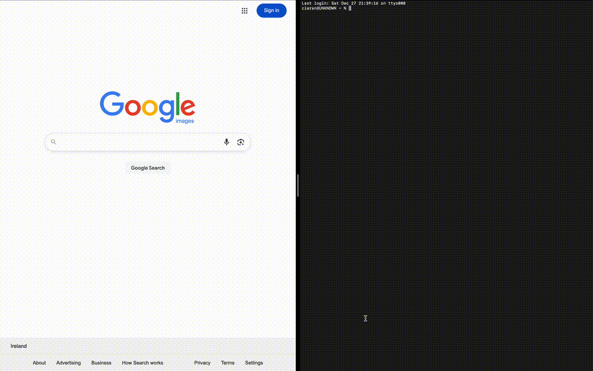

# Apple Intelligence File Sorter for Mac

Local-first intelligent file organization system using existing native on-device LLMs from Apple Intellience.

This project automatically watches selected directories and intelligently renames, classifies, and organizes files in real time. It runs fully offline with no cloud services and no external APIs.

On macOS it uses Apple's built-in Vision framework for on-device AI.  
Cross-platform fallback using Ollama is planned to come soon for Linux and Windows or users without Apple Intelligence enabled.

---

## Features

- Event-driven file monitoring using watchdog
- On-device AI file understanding on macOS
- Automatic file renaming and categorization
- Extensible datatype classification system
- Config auto-generation on first run
- Full audit logging
- Fully offline operation

---

## Architecture Overview

app.py
core/
engine.py
ai_engine.py
file_watcher.py
config/
default_config.json
config.json
datatypes.json
logs/

yaml
Copy code

System flow:

Files appear  
System observes  
AI suggests meaning  
Engine renames  
Engine categorizes  
Engine moves  
Logs are written

---

## AI Behavior

### macOS

Uses the native Vision framework:
- OCR text recognition
- Image classification
- Confidence-weighted naming suggestions

Runs fully offline using Apple's on-device ML stack.

### Cross-platform

Planned fallback support using Ollama:
- Local LLM-based classification and description
- Linux, Windows, and macOS support

---

## Installation

clone this repo
cd local-ai-file-sorter
python3 app.py

yaml
Copy code

The application automatically:
- Creates a virtual environment
- Installs dependencies
- Generates the default configuration on first run

---

## Configuration

On first run a configuration file is generated at:

config/config.json

yaml
Copy code

This file controls:
- Watched directories
- File naming rules
- Sorting behavior
- AI usage
- Stability and safety parameters

The `datatypes.json` file defines how file extensions map to domain folders and is fully user-extensible.

---

## Project Status

This project is under active development.

Core functionality is stable.  
The AI abstraction layer is evolving toward full cross-platform support.

Planned improvements:
- Dedicated AI engine abstraction layer
- Ollama backend
- Folder-level learning
- User feedback loop for naming accuracy

---

## License

MIT License - Use, modify, distribute and contribute freely.